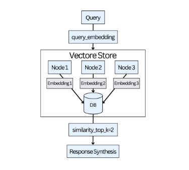

# LlamaIndex Introduction

LlamaIndex, like other LLM tooling frameworks, allows for the easy creation of LLM-powered apps with useful and straightforward abstractions. LlamaIndex makes it simple to build RAG-based applications by combining extracting relevant information from large databases with the text generation capabilities of LLMs. This section provides an overview of LlamaIndex and some essential concepts. RAG systems will be covered in more depth in Chapters 8 and 9.

## Data Connectors

The performance of RAG-based applications is notably improved when they access a vector store compiling information from multiple sources. However, handling data in various formats presents particular challenges. Data connectors, known as Readers, play a crucial role in addressing this. They parse and convert data into a more manageable format, which includes text and basic metadata, and simplify the data ingestion process. They automate data collection from different sources, including APIs, PDFs, and SQL databases, and effectively format this data.

The open-source project  [LlamaHub](https://llamahub.ai/)  hosts various data connectors to incorporate multiple data formats into the LLM.

You can check out some of the loaders on the  [LlamaHub](https://llamahub.ai/)  GitHub repository, including the  [Wikipedia](https://llamahub.ai/l/readers/llama-index-readers-wikipedia?from=)  integration used in the example.

## Nodes

In LlamaIndex, the documents undergo a transformation within a processing framework after data ingestion. This process converts documents into smaller, more detailed units called Node objects. Nodes are derived from the original documents and include the primary content, metadata, and contextual details. LlamaIndex includes a NodeParser class, automatically transforming document content into structured nodes.

## Indices

LlamaIndex is proficient in indexing and searching through diverse data formats, including documents, PDFs, and database queries. Indexing represents a foundational step in data storage within a database. This process involves transforming unstructured data into embeddings that capture semantic meanings. This transformation optimizes the data format, facilitating easy access and querying.

LlamaIndex offers various index types, each designed to fulfill a different purpose.

### Summary Index

The  [Summary Index](https://docs.llamaindex.ai/en/stable/examples/index_structs/doc_summary/DocSummary.html)  extracts a summary from each document and saves it with all its nodes. Having a document summary can be helpful, especially when matching small node embeddings with a query, which is not always straightforward.

### Vector Store Index

The  [Vector Store Index](https://docs.llamaindex.ai/en/stable/module_guides/indexing/vector_store_guide.html)  generates embeddings during index construction to identify the top-k most similar nodes in response to a query.

It’s suitable for small-scale applications and easily scalable to accommodate larger datasets using high-performance vector databases.

*Fetching the top-k nodes and passing them for generating the final response.*

## Query Engines
The query engine is a pipeline that combines a retriever and a response synthesizer. The pipeline retrieves nodes using the query string and then sends them to the LLM to build a response. A query engine can be constructed by invoking the as_query_engine() method on a previously created index.

The indexes can also function solely as retrievers for fetching documents relevant to a query. This capability enables the creation of a custom query engine, offering more control over various aspects, such as the prompt or the output format. Find the LlamaIndex documentation on  [defining a custom query engine](https://docs.llamaindex.ai/en/stable/examples/query_engine/custom_query_engine/)  at  [towardsai.net/book](http://towardsai.net/book).

## Routers

[Routers](https://docs.llamaindex.ai/en/stable/module_guides/querying/router/root.html)  help select the most suitable retriever for extracting context from a knowledge base. They choose the most appropriate query engine for a specific task, enhancing performance and accuracy.

This functionality is particularly advantageous in scenarios involving multiple data sources, where each source contains distinct information. For instance, routers determine which data source is the most relevant for a given query in an application that uses a SQL database, graph database, and/or a vector database as its knowledge base.