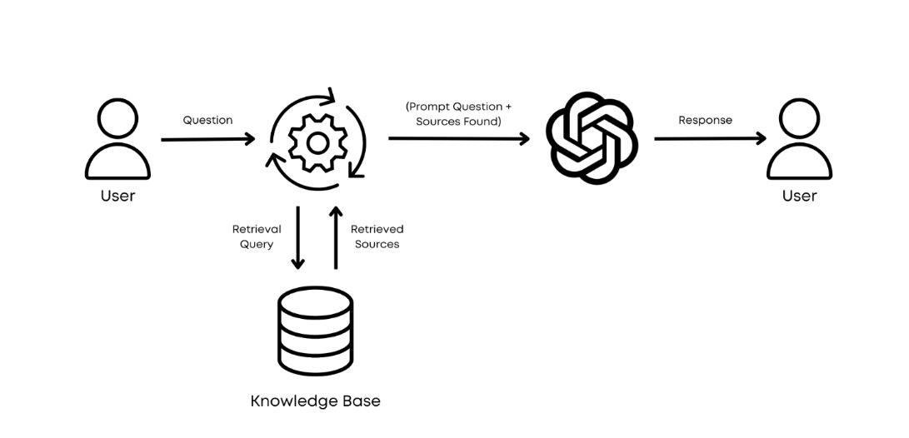

## Why RAG?

> *A basic visual representation of retrieval-augmented generation (RAG). The user question is used to retrieve the most relevant information from the knowledge base to answer it. Then, this information is integrated into the prompt, which is sent to the language model (e.g., GPT-4) to answer the question. The final response is sent back to the user.*

[Retrieval-augmented generation (RAG)](https://arxiv.org/abs/2005.11401v4) is a method created by the FAIR team at Meta to enhance the accuracy of large language models (LLMs) and reduce false information or “hallucinations”. RAG improves LLMs by adding an information retrieval step before generating an answer, which systematically incorporates relevant data from external knowledge sources into the LLM’s input prompt. This helps chatbots provide more accurate and context-specific information by supplementing the LLM’s internal knowledge with relevant external data like private documentation, PDFs, codebases, or SQL databases.

One key benefit of RAG is its ability to cite sources in responses, allowing users to verify the information and increase trust in the model’s outputs. RAG also supports the integration of frequently updated and domain-specific knowledge, which is typically more complex through LLM fine-tuning.

When deciding on the amount of contextual information to give the LLM, consider the application’s requirements and limitations, such as acceptable latency, desired accuracy, and available computational resources. As general rules to choose whether to use RAG or put all your context into the LLM context window, consider the following:

-   RAG is best suited for scenarios where you need to process large datasets that cannot fit within a single LLM context window and when fast response times and low latency are necessary. It is also ideal when cost-effectiveness is a priority, particularly when using LLMs via APIs or when transparency and the ability to show retrieved documents are essential.
-   On the other hand, long context models are preferable when dealing with smaller datasets (e.g., one pdf file) or one-off tasks that can fit within their extended context window. These models are suitable when processing time is not a critical factor, and you can tolerate potential delays in response. They are also well-suited for applications that require complex single-document analysis or summarization tasks and when the volume of prompts per hour is low, making the management of computational resources feasible.

*Nowadays, a RAG system has a standard architecture already implemented in popular frameworks, so developers don’t have to reinvent the wheel. For example, LangChain and LlamaIndex offer user-friendly classes for implementing a retriever on your data source, with the first step being index creation for your data*.